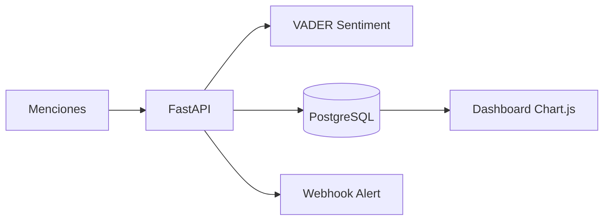

# SentimentTrend Bot

API de monitoreo de reputación con **análisis de sentimiento**, **alertas automáticas por webhook** y **mini-dashboard** con métricas en tiempo real.

> Proyecto de portafolio — FastAPI · PostgreSQL · VADER Sentiment · Chart.js

## Qué hace

1. Recibes menciones públicas simuladas (comentarios, reseñas).
2. La API clasifica sentimiento (`positive` / `neutral` / `negative`).
3. Si hay un pico de negatividad, dispara webhook (Discord/Slack).
4. El dashboard muestra KPIs, gráficos de distribución y evolución temporal.

## Demo rápida

```bash
docker compose up --build
```

En otra terminal:

```bash
pip install -r requirements.txt
python scripts/seed_demo.py --reset
```

Abre **http://localhost:8000** → dashboard  
Swagger: **http://localhost:8000/docs**

## Capturas para portafolio

| Qué grabar | Para qué sirve |
|------------|----------------|
| Dashboard con gráficos | Emplea INACAP, LinkedIn, README |
| POST en Swagger + alerta webhook | Entrevista técnica |
| Repo público en GitHub | CV y portafolio Emplea INACAP |

## Variables de entorno

Copia `.env.example` a `.env`:

| Variable | Descripción |
|----------|-------------|
| `DATABASE_URL` | Conexión PostgreSQL |
| `WEBHOOK_URL` | URL Discord/Slack (opcional) |
| `ALERT_NEGATIVE_THRESHOLD` | Negativos para alertar (default: 3) |
| `ALERT_WINDOW_MINUTES` | Ventana en minutos (default: 60) |

### Webhook Discord

Crea un webhook en tu servidor Discord y pégalo en `WEBHOOK_URL`.

## API principal

```http
POST /api/mentions
{"brand": "novahome", "text": "Pésima atención", "source": "twitter"}

GET /api/dashboard/novahome/metrics?hours=24
GET /api/dashboard/novahome/timeline?hours=24
GET /api/dashboard/novahome/alerts
```

## Tests

```bash
pip install -r requirements.txt
pytest
```

## Arquitectura



## Autor

**Osvaldo Andrés Díaz Guzmán** — Estudiante Ing. en Informática INACAP · Antofagasta, Chile
